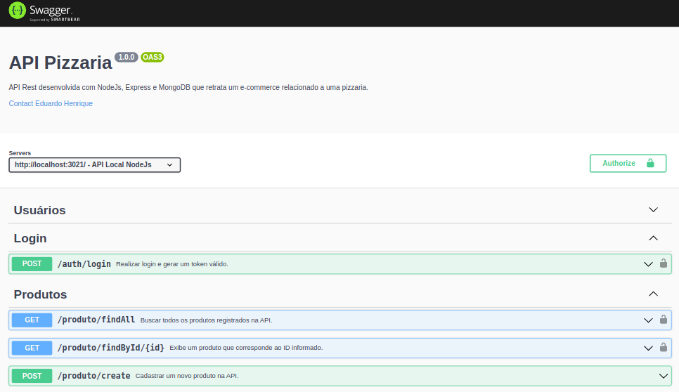

<h1>API Rest</h1>

Projeto para simular uma API de um e-commerce com todas funcionalidades, desde criar um usuário à realizar um pedido.

<ul>
<li>Usuários - CRUD</li>
<li>Realizar login através de um token válido</li>
<li>Produtos - CRUD</li>
<li>Categorias - CRUD</li>
<li>Pedidos - CRUD</li>
<li>Carrinho - CRUD</li>
</ul>
<h2>Documentado com Swagger</h2>

<h2>Tecnologias utilizadas</h2>
<ol>
<li>NodeJS</li>
<li>Express</li>
<li>MongoDB</li>
<li>Json Web Token</li>
<li>Bcrypt</li>
</ol>

<h2>Rodar o projeto</h2>
<ol>
<li>Clone o repositório</li>
<li>Abra o terminal do VSCode e execute o comando: npm i</li>
<li>Rode o projeto com o comando: npm run dev</li>
<li>Confira todos endpoints através do ThunderClient</li>
</ol>

